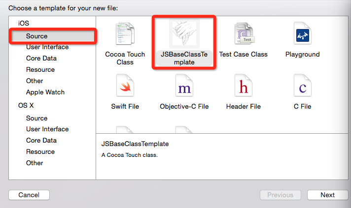

# 自定义类模板

创建一个项目，如果要创建一个基于UIViewController的类模板，则新建一个基于UIViewController的文件，在.m文件内添加需要继承的方法，然后修改.h文件以及.m文件的头部如下：

* .h文件

* .m文件

修改文件名为`___FILEBASENAME___`

新建一个目录，并将.h文件和.m文件放到该目录下

从Xcode对应的目录下，取一个plist文件放到刚才新建的目录下

修改plist文件如下

然后将新建的目录整体放到Xcode对应的目录下方

现在在工程里面，如果新建一个文件，就可以看到自定义的类模板了

